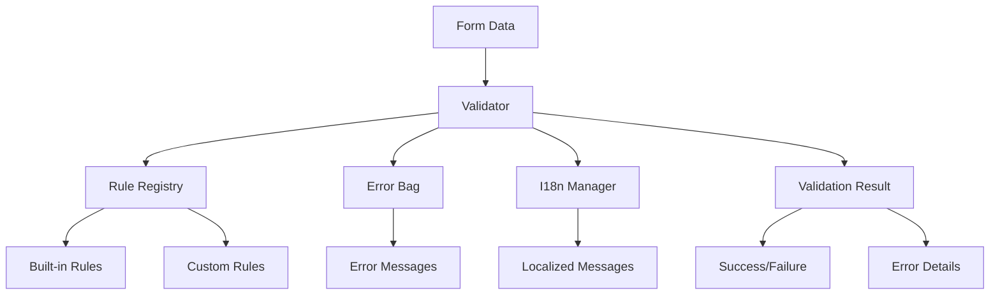

# Introduction

Universal Validator is a modern, framework-agnostic validation library designed to work seamlessly across different JavaScript environments. Whether you're building with vanilla JavaScript, Vue.js, React, or any other framework, Universal Validator provides a consistent and powerful validation experience.

## Key Features

### 🌐 Universal Compatibility
- **Framework Agnostic**: Works with any JavaScript framework or vanilla JS
- **Consistent API**: Same validation logic across all environments
- **No Dependencies**: Zero external dependencies in the core library

### ⚡ Reactive Validation
- **Real-time Feedback**: Validate as users type or interact with forms
- **Automatic UI Updates**: Built-in reactivity for Vue.js applications
- **Manual Control**: Full control over when and how validation occurs

### 🎯 Scope-based Architecture
- **Isolated Forms**: Multiple forms on the same page with separate validation states
- **Global Rules**: Define validation rules once, use them across different scopes
- **Flexible Data Management**: Each scope maintains its own form data and validation state

### 🧩 Extensible Design
- **Custom Rules**: Easy to create and register custom validation rules
- **Async Support**: Built-in support for asynchronous validation (API calls, etc.)
- **Rule Composition**: Combine multiple rules for complex validation scenarios

### 🌍 Internationalization
- **Multi-language Support**: Built-in i18n system with locale switching
- **Custom Messages**: Override default messages with your own
- **Dynamic Loading**: Load language packs on demand

## How It Works

Universal Validator follows a simple but powerful pattern:

1. **Define Rules**: Set up validation rules for your form fields
2. **Validate Data**: Pass your form data to the validator
3. **Handle Results**: React to validation results and display errors
4. **Scope Management**: Use scopes to manage multiple forms independently

```javascript
// 1. Create validator and define rules
const validator = createValidator();
validator.setRules('email', { required: true, email: true });

// 2. Validate data
const isValid = await validator.validate({ email: 'user@example.com' });

// 3. Handle results
if (!isValid) {
  const errors = validator.errors().allByField();
  console.log('Validation errors:', errors);
}
```

## Architecture Overview



## Getting Started

Ready to start validating? Head over to the [Installation Guide](./installation.md) to get Universal Validator set up in your project.

## What's Next?

- [**Installation**](./installation.md) - Get Universal Validator installed and configured
- [**Basic Usage**](./basic-usage.md) - Learn the fundamental concepts and API
- [**Validation Rules**](./validation-rules.md) - Explore all available validation rules
- [**Advanced Guide**](./advanced.md) - Deep dive into advanced patterns and techniques
